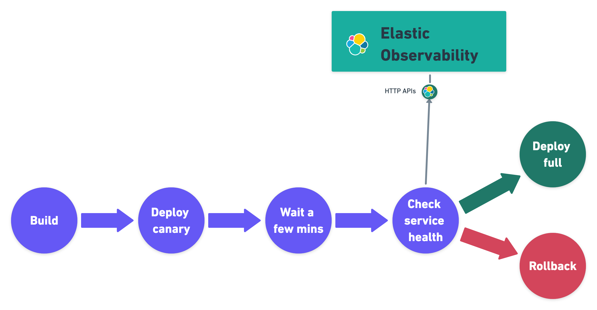

<div id="ci-cd-observability"></div>

export let figure_caption = undefined

To help administrators monitor and troubleshoot their CI/CD platform and help developers
increase the speed and reliability of their CI/CD pipelines, Elastic ((observability))
provides visibility in Continuous Integration and Continuous Delivery (CI/CD) processes.

To provide monitoring dashboards, alerting, and root cause analysis on pipelines, Elastic
works with the communities of the most popular CI/CD platforms to instrument tools with
OpenTelemetry.

<div id="ci-cd-architecture"></div>

## CI/CD observability architectures

Using the APM Server, connect all your OpenTelemetry native CI/CD tools directly to Elastic ((observability)).

.Architecture of CI/CD observability with Elastic


A more advanced CI/CD observability architecture includes an OpenTelemetry Collector
deployed on the edge, next to the CI/CD tools. This architecture provides the following:

* Low latency between the CI/CD tools and the collector is particularly beneficial to
    ephemeral tools like the otel-cli.

* The ability to route the observability signals to multiple backends in addition to
    Elastic ((observability)).

.Advanced architecture of CI/CD observability with Elastic


<div id="ci-cd-administrators"></div>

{/* lint ignore observability */}

<div id="observability_for_ci/cd_administrators"></div>

## Observability for CI/CD administrators

Elastic ((observability)) allows CI/CD administrators to monitor and troubleshoot CI/CD
platforms and detect anomalies.

<div id="ci-cd-monitoring"></div>

### CI/CD platform monitoring and alerting

Elastic ((observability)) helps CI/CD administrators monitor their platform by providing KPI dashboards
of CI systems.

The Jenkins health dashboards provide insights on the build executions, the failures, the
provisioning of build agents, the active and idle workers, or the JVM health.

.Jenkins KPIs in Elastic ((observability))


.Jenkins Provisioning KPIs in Elastic ((observability))


.Jenkins JVM health indicators in Elastic ((observability))


<div id="ci-cd-troubleshooting"></div>

### CI/CD platform troubleshooting

CI/CD administrators need to assess the impact of anomalies when troubleshooting platform problems quickly,
whether troubleshooting just one pipeline to much broader outages impacting many pipelines or the entire CI/CD platform.

Elastic ((observability)) enables troubleshooting CI platform outages by providing visualizations of pipeline
executions as distributed traces, along with the capability to slice and dice pipeline executions in any dimension
to assess the nature and the impact of the outage.

In the following image, a Jenkins CI build failed, and its exceptions are reported as errors.
Select any of those errors to view the specific information. In this case, it's errors relating to
the CI agent that stopped.

.Jenkins pipeline build error in Elastic ((observability))


The Errors overview screen provides a high-level view of the exceptions that CI builds catch.
Similar errors are grouped to quickly see which ones are affecting your services
and allow you to take action to rectify them.

.Jenkins jobs and pipelines errors in Elastic ((observability))


.Concourse CI pipeline execution as a trace in Elastic ((observability))


<div id="ci-cd-developers"></div>

{/* lint ignore observability */}

<div id="observability_for_developers"></div>

## Observability for developers

Development teams need to continuously optimize their ever-changing CI/CD pipelines to improve
their reliability while chasing faster pipelines. Visualizations of pipelines as distributed
traces help to document what’s happening and improve performance and reliability (flaky tests and pipelines).

Integrating with many popular CI/CD and DevOps tools like Maven or Ansible using OpenTelemetry, Elastic ((observability))
solves these problems by providing deep insights into the execution of CI/CD pipelines.

<div id="ci-cd-visibility"></div>

### CI/CD pipeline visibility

The visualization of CI/CD pipelines as distributed traces in Elastic ((observability)) provides
documentation and health indicators of all your pipelines.

The APM Service view in Elastic ((observability)) provides a view of all your instrumented CI/CD
servers with insights on their KPIs.

.Jenkins servers in Elastic ((observability))


The Service page provides more granular insights into your CI/CD workflows by breaking down health
and performance metrics by pipeline. To quickly view which pipelines experience the most errors, are the
most frequently executed, or are the slowest, you can sort and filter the list.

.A Jenkins server in Elastic ((observability))


<div id="ci-cd-pipelines"></div>

### Individual pipeline visibility

Once you’ve identified the pipeline you want to troubleshoot, you can drill down to get more detailed
information about its performance over time. The pipeline summary shows a breakdown of duration and
failure rates across the pipeline’s individual builds and jobs to spot slowdowns or failures.

.Performance overview of a Jenkins pipeline in Elastic ((observability))


The pipelines and traditional jobs are instrumented automatically. If you spot a slow or failing
build and need to understand what’s happening, you can drill into the trace view of the build to look
for the high duration jobs or jobs with errors. You can then dig into the details to understand the
source of the error.

.A Jenkins pipeline build as a trace in Elastic ((observability))


To investigate further, you can view the details of the build captured as labels.

.Contextual attributes of a Jenkins pipeline execution in Elastic ((observability))


<div id="ci-cd-store-jenkins-logs"></div>

## Store Jenkins pipeline logs in Elastic

Jenkins pipeline logs can be sent through the OpenTelemetry Protocol (OTLP) to be stored
in an observability backend alongside the traces of the pipeline builds and Jenkins health metrics.
Storing logs in an observability backend provides several benefits including:

* Better observability, monitoring, alerting, and troubleshooting of the Jenkins instance
    thanks to the unification of all the signals in the observability backend.

* Better traceability and long term storage for builds so you can more easily
    audit the Software Delivery Lifecycle.

* Better scalability and reliability of Jenkins by greatly reducing the quantity of data stored in
    Jenkins and limiting the well known file system performance challenges of Jenkins when storing a large history of builds.

<div id="ci-cd-store-jenkins-logs-requirements-configuration"></div>

### Requirements and configuration

Storing Jenkins pipeline logs in Elastic requires:

* Elastic ((observability)) version 8.1 or higher.
* The OpenTelemetry Protocol endpoint configured on the Jenkins OpenTelemetry Plugin to be
    reachable from the Jenkins Agents (i.e. don't specify a localhost OTLP endpoint unless OpenTelemetry
    collectors are also deployed on the Jenkins Agents).

* When using OpenTelemetry Collectors, to set up a [logs pipeline](https://opentelemetry.io/docs/collector/configuration/#service)
    in addition to the traces and metrics pipelines.

To store pipeline logs in Elastic:

{/* lint ignore observability visualisation */}
1. Navigate to the _OpenTelemetry_ section of the Jenkins configuration screen.
1. Set the _OTLP Endpoint_.
1. Use the _Add Visualisation Observability Backend_ drop-down to select the **Elastic ((observability))** option.
1. Set the _((kib)) base URL_.
1. Click the _Advanced_ button to choose a storage integration strategy.
    There are two options for storing pipeline logs in Elastic ((observability)):

    * **Store pipeline logs in Elastic and visualize logs both in Elastic and through Jenkins**,
        which means you can view logs stored in Elastic on demand in the Jenkins UI.
        Read more in <DocLink id="enObservabilityCiCdObservability" section="visualize-logs-in-both-((kib))-and-jenkins">Visualize logs in both ((kib)) and Jenkins</DocLink> below.

    * **Store pipeline logs in Elastic and visualize logs exclusively in Elastic**,
        which means logs will no longer be visible through the Jenkins UI.
        Read more in <DocLink id="enObservabilityCiCdObservability" section="visualize-logs-exclusively-in-((kib))">Visualize logs exclusively in ((kib))</DocLink> below.

Visualizing logs both in Elastic and through Jenkins is recommended because it provides a more seamless user experience
by continuing to render the logs in the Jenkins UI while allowing you to verify the ((es)) setup.

<div id="ci-cd-visualize-logs-kibana-and-jenkins"></div>

### Visualize logs in both ((kib)) and Jenkins

The Jenkins OpenTelemetry Plugin provides pipeline log storage in ((es)) while enabling you to
visualize the logs in ((kib)) and continue to display them through the Jenkins pipeline build console.

<DocImage size="xl" url="images/ci-cd-visualize-logs-kibana-and-jenkins-console.png" alt="Jenkins Console Output page displaying both log contents and a link to view logs in Elastic ((observability))" />

This more advanced setup requires connecting the Jenkins Controller to ((es)) with read permissions
on the `logs-apm.app` and preferably on the Metadata of the ((ilm-init)) policy of this index template
(by default it's the `logs-apm.app_logs-default_policy` policy).
Use "Validate ((es)) configuration" to verify the setup.

.Architecture for storing pipeline logs in Elastic and visualizing logs in both Elastic and Jenkins
<DocImage size="xl" url="images/ci-cd-visualize-logs-kibana-and-jenkins-architecture.png" alt="Architecture diagram for storing pipeline logs in Elastic and visualizing logs in both Elastic and Jenkins" />

<div id="ci-cd-visualize-logs-kibana"></div>

### Visualize logs exclusively in ((kib))

Visualizing logs exclusively in ((kib)) involves a simpler setup that doesn't require access
to ((es)) from the Jenkins Controller. This is because the Jenkins pipeline build console
displays a hyperlink to the ((kib)) logs visualization screen instead of displaying the logs
in the Jenkins UI.

<DocImage size="xl" url="images/ci-cd-visualize-logs-kibana-console.png" alt="Jenkins Console Output page with link to view logs in Elastic ((observability))" />

.Architecture for storing pipeline logs in Elastic and visualizing logs exclusively in Elastic
<DocImage size="xl" url="images/ci-cd-visualize-logs-kibana-architecture.png" alt="Architecture diagram for storing pipeline logs in Elastic and visualizing logs exclusively in Elastic" />

<div id="ci-cd-instrumentation"></div>

## Instrument CI/CD pipelines

Observing CI/CD pipelines is achieved by instrumenting the different CI/CD and DevOps tools.
Elastic works with the Open Source communities leveraging OpenTelemetry to provide the best coverage.

<div id="ci-cd-jenkins"></div>

### Jenkins

<div id="ci-cd-install-jenkins"></div>

#### Install the OpenTelemetry plugin

1. On the Jenkins UI, go to **Manage Jenkins** > **Manage Plugins**.

    

1. Click the **Available** tab, and search for **OpenTelemetry**.
1. Select the **OpenTelemetry** checkbox and then click **Download now and install after restart**.

    To verify that the plugin is installed, click the **Installed** tab, and search for **OpenTelemetry Plugin**.

<div id="ci-cd-configure-jenkins"></div>

#### Configure the OpenTelemetry plugin

The OpenTelemetry plugin needs to be configured to report data to an OpenTelemetry service.
In addition, you will need the endpoint of the OpenTelemetry service, the type of authentication,
and the access credentials.

1. On the Jenkins UI, go to **Manage Jenkins** > **Configure System**.
1. Go to the OpenTelemetry Plugin section.
1. Configure your OpenTelemetry endpoint and authentication using the Elastic APM Server URL and the APM Server authentication:

* If using the Elastic APM secret token authorization, select a **Bearer Authentication Token**, and add the token
    as a Jenkins secret text credential.

    

* If using the Elastic API Key authorization, define the **Header Authentications**:
    * Header name: `"Authorization"`
    * Header value: a secret text credential with the value of `"ApiKey an_api_key"` (`an_api_key` is the value of the secret key)

{/* lint ignore observability visualisation */}
1. Go to **Add Visualisation Observability Backend** and define the URL for your ((kib)) server.

    

1. Finally, there are additional settings to configure:

* Endpoint certificates to use in communications.
* The service name and service namespace sent to the OpenTelemetry service.
* Timeouts and batch process times.
* Any steps you may want to omit from the data you send.

    <DocCallOut title="Warning" color="warning">
    You can export the OpenTelemetry configuration as environment variables to use them with other tools like otel-cli,
    Ansible Otel plugin, and so on. If you enable this option, consider that you can potentially expose the credentials in
    the console output.
    </DocCallOut>

To learn more about the integration of Jenkins with Elastic ((observability)), see [OpenTelemetry](https://plugins.jenkins.io/opentelemetry/).

<div id="ci-cd-jenkins-dashbaords"></div>

#### Install Jenkins dashboards in ((kib))

There are out of the box ((kib)) dashboards that help visualize some metrics for the CI/CD platform.

Using the [Import API](((kibana-ref))/dashboard-import-api.html) or the ((kib)) UI, you
can [install dashboards](https://github.com/jenkinsci/opentelemetry-plugin/blob/master/docs/DASHBOARDS.md#elastic)
that are compatible with version 7.12 or higher.

For instance, you can follow the below steps:

* Import the dashboard in the ((kib)) UI

.Import dashboard in ((kib))


* The new dashboard is now ready to be used:

.Jenkins dashboard in ((kib)) is ready


.Jenkins dashboard in ((kib))


<div id="ci-cd-maven"></div>

### Maven

The Maven OpenTelemetry extension integration provides comprehensive visibility into all of your Maven builds.
The extension generates traces for each build and performance metrics to help you understand which Maven goals
or Maven submodules are run the most, how often they fail, and how long they take to complete.

The context propagation from CI pipelines (Jenkins job or pipeline) is passed to the Maven build
through the `TRACEPARENT` and `TRACESTATE` environment variables that match the [W3C Trace Context specification](https://www.w3.org/TR/trace-context/).
Therefore, everything that happens in the CI platform is also shown in the traces.

You can configure your Maven project with the [Maven OpenTelemetry extension](https://github.com/open-telemetry/opentelemetry-java-contrib/tree/main/maven-extension).
For example, you can add the following snippet to your pom.xml file:

```bash
<project>
  ...
  <build>
    <extensions>
      <extension>
          <groupId>io.opentelemetry.contrib</groupId>
          <artifactId>opentelemetry-maven-extension</artifactId>
          <version>1.12.0-alpha</version>
      </extension>
    </extensions>
  </build>
</project>
```

You can now trigger to send the Maven build reporting performance data to Elastic ((observability)) by
passing the configuration details as environment variables:

```bash
export OTEL_EXPORTER_OTLP_ENDPOINT="https://elastic-apm-server.example.com:8200"
export OTEL_EXPORTER_OTLP_HEADERS="Authorization=Bearer an_apm_secret_token"
export OTEL_TRACES_EXPORTER="otlp"

mvn verify
```

You can instrument Maven builds without modifying the pom.xml file using the Maven
command line argument “-Dmaven.ext.class.path=...”

```bash
export OTEL_EXPORTER_OTLP_ENDPOINT="https://elastic-apm-server.example.com:8200"
export OTEL_EXPORTER_OTLP_HEADERS="Authorization=Bearer an_apm_secret_token"
export OTEL_TRACES_EXPORTER="otlp"

mvn -Dmaven.ext.class.path=path/to/opentelemetry-maven-extension.jar verify
```

You can also trigger your Maven builds from the CI platform and visualize the end-to-end
pipeline execution in Elastic ((observability)), including the detailed steps of your CI
pipeline and the Maven build.

When invoking Maven builds with Jenkins, it’s unnecessary to use environment variables
to configure the Maven build (`OTEL_EXPORTER_OTLP_ENDPOINT…`) to rely on the Jenkins capability
to inject OpenTelemetry configuration as environment variables. For more details, refer to <DocLink id="enObservabilityCiCdObservability" section="install-the-opentelemetry-plugin">Install the OpenTelemetry plugin</DocLink>.

.A Jenkins pipeline executing Maven builds


To learn more, see the [integration of Maven builds with Elastic ((observability))](https://github.com/open-telemetry/opentelemetry-java-contrib/tree/main/maven-extension).

<div id="ci-cd-ansible"></div>

### Ansible

The Ansible OpenTelemetry plugin integration provides visibility into all your
Ansible playbooks. The plugin generates traces for each run and performance metrics to help
you understand which Ansible tasks or roles are run the most, how often they
fail, and how long they take to complete.

You can configure your Ansible playbooks with the [Ansible OpenTelemetry callback plugin](https://docs.ansible.com/ansible/latest/collections/community/general/opentelemetry_callback.html).
It’s required to install the OpenTelemetry python libraries and configure the callback
as stated in the [examples](https://docs.ansible.com/ansible/latest/collections/community/general/opentelemetry_callback.html#examples) section.

The context propagation from the Jenkins job or pipeline is passed to the Ansible run. Therefore,
everything that happens in the CI is also shown in the traces.

.Visibility into your Ansible playbooks


This integration feeds, out of the box, the Service Map with all the services that are connected to the Ansible Playbook.
All of these features can help you quickly and visually assess your services used in your provisioning and Continuous Deployment.

.ServiceMap view of a Jenkins pipeline execution instrumented with the Ansible plugin


<div id="ci-cd-ansible-tower"></div>

### Ansible AWX/Tower

The Ansible OpenTelemetry plugin integration supports Ansible AWX/Tower. To enable it, follow these steps.

AWX requires an Execution Environment with the Ansible and Python packages installed.
You can use the [Ansible Builder CLI tool](https://www.ansible.com/blog/introduction-to-ansible-builder) to create the container definition.
Then upload the container to an image repository accessible by AWX and define an Execution Environment using the container you created.

To inject the environment variables and service details, use custom credential types and assign the credentials to the Playbook template.
This gives you the flexibility to reuse the endpoint details for Elastic APM and also standardize on custom fields for reporting purposes.

.An APM Service Endpoint in Ansible AWX/Tower


.Custom fileds in Ansible AWX/Tower


Want to learn more? This [blog post](https://www.elastic.co/blog/5-questions-about-ansible-that-elastic-observability-can-answer) provides a great
overview of how all of these pieces work together.

<div id="ci-cd-otel-cli"></div>

### Otel CLI

[otel-cli](https://github.com/equinix-labs/otel-cli) is a command-line tool for sending OpenTelemetry
traces, which is useful if instrumenting your scripts explicitly when no other implicit
integration is in place.

Using the otel-cli wrapper, you can configure your build scripts implemented in shell, make, or
another scripting language. For example, instrumenting the Makefile below with otel-cli helps
visualize every command in each goal as spans.

```bash
# see https://blog.container-solutions.com/tagging-docker-images-the-right-way

NAME   := acmecorp/foo
TAG    := $$(git log -1 --pretty=%!H(MISSING))
IMG    := ${NAME}:${TAG}
LATEST := ${NAME}:latest

build:
  @otel-cli exec \
    --name 'docker build' \
    docker build -t ${IMG} .
  @otel-cli exec \
    --name 'docker tag' \
    docker tag ${IMG} ${LATEST}

push:
  @otel-cli exec \
    --name 'docker push' \
    --attrs "http.url=https://docker.elastic.dev" \
    docker push ${NAME}

login:
  @otel-cli exec \
    --name 'docker login' \
    --attrs 'rpc.system=grpc' \
    docker login -u ${DOCKER_USER} -p ${DOCKER_PASS}
```

To invoke shell scripts that use otel-cli for tracing:

```bash
export OTEL_EXPORTER_OTLP_ENDPOINT="elastic-apm-server.example.com:8200"
export OTEL_EXPORTER_OTLP_HEADERS="Authorization=Bearer an_apm_secret_token"
export OTEL_TRACES_EXPORTER="otlp"

make login build push
```

.A Jenkins build executing a Makefile instrumented with the otel-cli in Elastic ((observability))


.ServiceMap view of a Jenkins pipeline execution instrumented with the otel-cli


<div id="ci-cd-pytest-otel"></div>

### Pytest-otel

[pytest-otel](https://pypi.org/project/pytest-otel/) is a pytest plugin for sending Python test
results as OpenTelemetry traces. The test traces help you understand test execution,
detect bottlenecks, and compare test executions across time to detect misbehavior and issues.

The context propagation from CI pipelines (Jenkins job or pipeline) is passed to the Maven build
through the `TRACEPARENT`.

```bash
OTEL_EXPORTER_OTLP_ENDPOINT=https://elastic-apm-server.example.com:8200 \
OTEL_EXPORTER_OTLP_HEADERS="authorization=Bearer an_apm_secret_token" \
OTEL_SERVICE_NAME=pytest_otel \
pytest --otel-session-name='My_Test_cases'
```

.Visibility into your Pytest tests


<div id="ci-cd-concourse-ci"></div>

### Concourse CI

To configure Concourse CI to send traces, refer to the [tracing](https://concourse-ci.org/tracing.html) docs.
In the Concourse configuration, you just need to define `CONCOURSE_TRACING_OTLP_ADDRESS`
and `CONCOURSE_TRACING_OTLP_HEADERS`.

```bash
CONCOURSE_TRACING_OTLP_ADDRESS=elastic-apm-server.example.com:8200
CONCOURSE_TRACING_OTLP_HEADERS=Authorization=Bearer your-secret-token
```

Context propagation is supported; therefore, you can benefit from the integrations described above.

Once Concourse CI tracing is configured, Concourse CI pipeline executions are
reported in Elastic ((observability)).

.A Concourse CI pipeline execution in Elastic ((observability))


The Concourse CI doesn’t report health metrics through OpenTelemetry. However, you can use the
[OpenTelemetry Collector Span Metrics Processor](https://github.com/open-telemetry/opentelemetry-collector-contrib/tree/main/processor/spanmetricsprocessor#span-metrics-processor)
to derive pipeline execution traces into KPI metrics like throughput and the error rate
of pipelines.

<div id="check-service-health-from-cd-pipelines"></div>

## Check service health from deployment pipelines

Integrating automated service health checks in deployment pipelines is critical for end-to-end deployment automation, which crucially enables deployment frequency to be increased.

Elastic ((observability)) exposes HTTP APIs to check the health of services. You can integrate these APIs in deployment pipelines to verify the behavior of newly deployed instances, and either automatically continue the deployments or roll back according to the health status.

The following example shows a canary deployment pipeline that leverages Elastic health check HTTP APIs to automate the quality check before rolling out the deployment from the canary to the entire set of instances:



Perform the health check by invoking the `KIBANA_URL/internal/apm/services` API to compare the transaction error rate of the service on the newly deployed instances with a threshold value. Pass the following parameters to the invocation:

* `start` and `end`: time interval using the [ISO-8601](https://en.wikipedia.org/wiki/ISO_8601) format (e.g. "2021-09-01T13:24:12Z" which is a UTC time)
* `kuery`: used to filter on the service name and, for example, the new version being deployed to narrow down to the canary instances. Example `service.name:"MY_SERVICE_NAME" AND service.version:"1.2.3"`
* `environment`: the environment on which the canary instances are deployed. Example: `production`.

To define the time range, use the `start` and `end` parameters. These parameters are
dates in ISO-8601 format. To query only one service, compose a filter in the parameter `kuery`,
then filter by the service name using the expression `service.name:MY_SERVICE_NAME
and service.version: SERVICE_VERSION`. Finally apply an `environment` filter by passing
the `environment` parameter. To select all environments, use `ENVIRONMENT_ALL`.

The API call requires authentication. We recommend to use an API Token to authenticate.

The API is subject to changes and a stable API optimized for Continuous Delivery use cases will soon be published.

```python
def check_service_health(service_name, service_version, error_rate_threshold, kibana_url, api_token):
    now = datetime.now()
    five_minutes_ago = now - timedelta(minutes=5)
    params = {
        "start": five_minutes_ago.strftime("%Y-%m-%dT%H:%M:%SZ"),
        "end": now.strftime("%Y-%m-%dT%H:%M:%SZ"),
        "kuery": "service.name:{} and service.version:{}".format(service_name, service_version),
        "environment": "ENVIRONMENT_ALL"
    }
    url = "{}/internal/apm/services?{}".format(kibana_url, urllib.parse.urlencode(params))
    req = urllib.request.Request(url=url, headers={"Authorization": "Bearer {}".format(api_token)})
    with urllib.request.urlopen(req) as response:
     body = response.read().decode("utf8")
     obj = json.loads(body)
     if len(obj['items']) > 0 and obj['items'][0].transactionErrorRate > error_rate_threshold:
            raise Exception("Error rate for service {} is higher than threshold {}, current value is {}".format(service_name, error_rate_threshold, obj['items'][0].transactionErrorRate))
```
