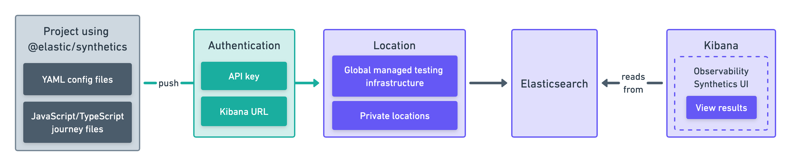

<div id="synthetics-get-started-project"></div>

Projects are the most powerful and sophisticated way to configure synthetic monitors in the ((stack)). Projects let you define your infrastructure as code, more commonly known as IaaC or Git-ops. With ((project-monitors)) you organize your YAML configuration and JavaScript- or TypeScript-defined monitors on the filesystem, use Git for version control, and deploy via a CLI tool, usually executed on a CI/CD platform.


{/* add text description */}

This is one of <DocLink slug="/en/observability/synthetics-get-started">two approaches</DocLink> you can use to set up a synthetic monitor.

<div id="prerequisites"></div>

## Prerequisites

You must be signed into ((kib)) as a user with at least <DocLink slug="/en/observability/synthetics-role-write">synthetics write permissions</DocLink>,
and Monitor Management must be enabled by an administrator as described in <DocLink slug="/en/observability/synthetics-role-setup">Setup role</DocLink>.

Working with projects requires working with the Elastic Synthetics CLI tool, which
can be invoked via the `npx @elastic/synthetics` command. Before getting started
you'll need to:

1. Install [Node.js](https://nodejs.dev/en/)
1. Install the package:

    ```sh
    npm install -g @elastic/synthetics
    ```

1. Confirm your system is setup correctly:

    ```sh
    npx @elastic/synthetics -h
    ```

You should also decide where you want to run the monitors before getting started.
You can run ((project-monitors)) on one or both of the following:

* **Elastic's global managed testing infrastructure**:
    With Elastic's global managed testing infrastructure, you can create and run monitors in multiple
    locations without having to manage your own infrastructure.
    Elastic takes care of software updates and capacity planning for you.

* **((private-location))s**: ((private-location))s allow you to run monitors from your own premises.
    To use ((private-location))s you must create a ((private-location)) before continuing.
    For step-by-step instructions, refer to <DocLink slug="/en/observability/synthetics-private-location">Monitor resources on private networks</DocLink>.

<DocCallOut title="Note">

If you are setting up Synthetics for a deployment configured with
[traffic filters](((cloud))/ec-traffic-filtering-deployment-configuration.html),
connections into ((es)) are restricted and results will not be able to be written
back into ((es)) unless granted.
For more details, refer to <DocLink slug="/en/observability/synthetics-traffic-filters">Use Synthetics with traffic filters</DocLink>.

</DocCallOut>

<div id="synthetics-get-started-project-init"></div>

## Create a project

Start by creating your first project. Run the command below to create a new
project named `projects-test` in the current directory.

```sh
npx @elastic/synthetics init projects-test
```

Then, follow the prompts on screen to setup the correct default variables for your project.
When complete, set the `SYNTHETICS_API_KEY` environment variable in your terminal, which is used
for authentication with your ((stack)):

1. To generate an API key:
    1. Go to **Synthetics** in ((kib)).
    1. Click **Settings**.
    1. Switch to the **Project API Keys** tab.
    1. Click **Generate Project API key**.

<DocCallOut title="Important" color="warning">

To generate a Project API key, you must be logged in as a user with the privileges
described in <DocLink slug="/en/observability/synthetics-role-write">Writer role</DocLink>.

</DocCallOut>


<DocCallOut title="Note">

To use an API key to push to Elastic's global managed testing infrastructure,
the _Elastic managed locations enabled_ toggle must be on when generating the API key.
If the _Elastic managed locations enabled_ toggle is disabled, an administrator has restricted
access to Elastic's global managed testing infrastructure.
Read more in the <DocLink slug="/en/observability/synthetics-role-write" section="to-restrict-using-elastics-global-managed-infrastructure">writer role documentation</DocLink>.

</DocCallOut>

1. Set the `SYNTHETICS_API_KEY` environment variable in your terminal.
    You will most likely want to set this permanently.
    This is done differently in [Powershell](https://learn.microsoft.com/en-us/powershell/module/microsoft.powershell.core/about/about_environment_variables?view=powershell-7.2#saving-changes-to-environment-variables) and [Bash](https://unix.stackexchange.com/a/117470).

<DocCallOut title="Note">
If you are pushing to a <DocLink slug="/en/observability/synthetics-private-location">((private-location))</DocLink>, you must use an API key generated in 8.4 or higher.
</DocCallOut>

Then, take a look at key files and directories inside your project:

* `journeys` is where you'll add `.ts` and `.js` files defining your browser monitors. When you create a new project, this directory will contain files defining sample monitors.
* `lightweight` is where you'll add `.yaml` files defining your lightweight monitors.  When you create a new project, this directory will contain a file defining sample monitors.
* `synthetics.config.ts` contains settings for your project. When you create a new project, it will contain some basic configuration options that you can customize later.

<DocCallOut title="Note">

The `synthetics.config.ts` in the sample project uses a location on Elastic's global managed testing infrastructure.
Administrators can restrict access to Elastic's global managed testing infrastructure.
When you attempt to <DocLink slug="/en/observability/synthetics-get-started-project" section="test-and-connect-to-the-((stack))">`push` the sample monitors</DocLink>,
if you see an error stating that you don't have permission to use Elastic managed global locations,
refer to the <DocLink slug="/en/observability/synthetics-troubleshooting" section="no-locations-are-available">troubleshooting guide</DocLink> for guidance.

</DocCallOut>

* `package.json` contains NPM settings for your project. Learn more in the [NPM documentation](https://docs.npmjs.com/about-packages-and-modules).
* `.github` contains sample workflow files to use with GitHub Actions.

<div id="examine_sample_monitors"></div>

## Examine sample monitors

Inside the `lightweight` directory you'll find sample lightweight monitors.
Here's an example of a YAML file defining a lightweight monitor:

```yml
# lightweight.yml
heartbeat.monitors:
- type: http
  name: Todos Lightweight
  id: todos-lightweight
  urls: "https://elastic.github.io/synthetics-demo/"
  schedule: '@every 1m'
```

For more details on lightweight monitor configuration options,
refer to <DocLink slug="/en/observability/synthetics-lightweight">Configure lightweight monitors</DocLink>.

Inside the `journeys` directory you'll find sample browser monitors.
Here's an example of a TypeScript file defining a browser monitor:

```ts
// example.journey.ts
import { journey, step, monitor, expect } from '@elastic/synthetics';
journey('My Example Journey', ({ page, params }) => {
  // Only relevant for the push command to create
  // monitors in Kibana
  monitor.use({
    id: 'example-monitor',
    schedule: 10,
  });
  step('launch application', async () => {
    await page.goto(params.url);
  });
  step('assert title', async () => {
    const header = await page.locator('h1');
    expect(await header.textContent()).toBe('todos');
  });
});
```

For more details on writing journeys and configuring browser monitors,
refer to <DocLink slug="/en/observability/synthetics-journeys">Scripting browser monitors</DocLink>.

<div id="synthetics-get-started-project-push"></div>

## Test and connect to the ((stack))

While inside the project directory you can do two things with the `npx @elastic/synthetics` command:

* Test browser-based monitors locally. To run all journeys defined in `.ts` and `.js` files:

    ```sh
    npx @elastic/synthetics journeys
    ```

* Push all monitor configurations to an Elastic deployment. Run the following command from inside your project:

    ```sh
    npx @elastic/synthetics push --auth $SYNTHETICS_API_KEY --url <kibana-url>
    ```

One monitor will appear in the ((synthetics-app)) for each journey or
lightweight monitor, and you'll manage all monitors from your local environment.
For more details on using the `push` command, refer to <DocLink slug="/en/observability/synthetics-command-reference" section="elasticsynthetics-push">`@elastic/synthetics push`</DocLink>.

<DocCallOut title="Note">

If you've <DocLink slug="/en/observability/synthetics-private-location">added a ((private-location))</DocLink>,
you can `push` to that ((private-location)).

To list available ((private-location))s,
run the <DocLink slug="/en/observability/synthetics-command-reference" section="elasticsynthetics-locations">`elastic-synthetics locations` command</DocLink>
with the ((kib)) URL for the deployment from which to fetch available locations.

</DocCallOut>

<div id="view_in_((kib))"></div>

## View in ((kib))

<DocCallOut title="Note">

When a monitor is created or updated, the first run might not occur immediately, but the time it takes for the first run to occur will be less than the monitor's configured frequency. For example, if you create a monitor and configure it to run every 10 minutes, the first run will occur within 10 minutes of being created. After the first run, the monitor will begin running regularly based on the configured frequency. You can run a manual test if you want to see the results more quickly.

</DocCallOut>

Then, go to the ((synthetics-app)) in ((kib)). You should see your newly pushed monitors running.
You can also go to the **Management** tab to see the monitors' configuration settings.

<div id="next_steps"></div>

## Next steps

Learn more about:

* <DocLink slug="/en/observability/synthetics-lightweight">Configuring lightweight monitors</DocLink>
* <DocLink slug="/en/observability/synthetics-create-test">Configuring browser monitors</DocLink>
* <DocLink slug="/en/observability/synthetics-manage-monitors" section="implement-best-practices-for-projects">Implementing best practices for working with ((project-monitors))</DocLink>

