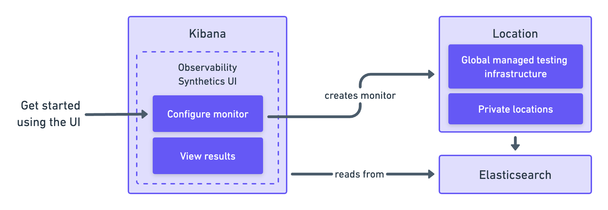

import GlobalManagedPaidFor from './synthetics-reference/global-managed-paid-for.mdx'

You can create synthetic monitors directly in the ((synthetics-app)) in ((kib)).

{/* add text description */}

This is one of <DocLink slug="/en/observability/synthetics-get-started">two approaches</DocLink> you can use to set up a synthetic monitor.

## Prerequisites

You must be signed into ((kib)) as a user with at least <DocLink slug="/en/observability/synthetics-role-write">synthetics write permissions</DocLink>,
and Monitor Management must be enabled by an administrator as described in <DocLink slug="/en/observability/synthetics-role-setup">Setup role</DocLink>.

You should decide where you want to run the monitors before getting started.
You can run monitors on one or both of the following:

* **Elastic's global managed testing infrastructure**:
    With Elastic's global managed testing infrastructure, you can create and run monitors in multiple
    locations without having to manage your own infrastructure.
    Elastic takes care of software updates and capacity planning for you.

* **((private-location))s**: ((private-location))s allow you to run monitors from your own premises.
    To use ((private-location))s you must create a ((private-location)) before continuing.
    For step-by-step instructions, refer to <DocLink slug="/en/observability/synthetics-private-location">Monitor resources on private networks</DocLink>.

<GlobalManagedPaidFor />

<DocCallOut title="Note">

If you are setting up Synthetics for a deployment configured with
[traffic filters](((cloud))/ec-traffic-filtering-deployment-configuration.html),
connections into ((es)) are restricted and results will not be able to be written
back into ((es)) unless granted.
For more details, refer to <DocLink slug="/en/observability/synthetics-traffic-filters">Use Synthetics with traffic filters</DocLink>.

</DocCallOut>

## Add a lightweight monitor

To use the ((synthetics-app)) to add a lightweight monitor:

1. Go to **Synthetics** in ((kib)).
1. Click **Create monitor**.
1. Set the monitor type to **HTTP Ping**, **TCP Ping**, or **ICMP Ping**.
1. In _Locations_, select one or more locations.

<DocCallOut title="Note">

If you don't see any locations listed, refer to the
<DocLink slug="/en/observability/synthetics-troubleshooting" section="no-locations-are-available">troubleshooting guide</DocLink> for guidance.

</DocCallOut>

1. Set the _Frequency_, and configure the monitor as needed.
1. Click **Advanced options** to see more ways to configure your monitor.
1. (Optional) Click **Run test** to verify that the test is valid.
1. Click **Create monitor**.

    

<DocCallOut title="Note">

If you've <DocLink slug="/en/observability/synthetics-private-location">added a ((private-location))</DocLink>,
you'll see your new ((private-location)) in the list of _Locations_.

</DocCallOut>

## Add a browser monitor

You can also create a browser monitor in the ((synthetics-app)) using an **Inline script**.

An inline script contains a single journey that you manage individually.
Inline scripts can be quick to set up, but can also be more difficult to manage.
Each browser monitor configured using an inline script can contain only _one_ journey,
which must be maintained directly in ((kib)).

If you depend on external packages, have your journeys next to your code repository,
or want to embed and manage more than one journey from a single monitor configuration,
use <DocLink slug="/en/observability/synthetics-get-started-project">((project-monitors))</DocLink> instead.

To use the ((synthetics-app)) to add a browser monitor:

1. Click **Create monitor**.
1. Set the monitor type to **Multistep**.
1. In _Locations_, select one or more locations.

<DocCallOut title="Note">

If you don't see any locations listed, refer to the
<DocLink slug="/en/observability/synthetics-troubleshooting" section="no-locations-are-available">troubleshooting guide</DocLink> for guidance.

</DocCallOut>

1. Set the _Frequency_.
1. Add steps to the **Script editor** code block directly.
    The `journey` keyword isn't required, and variables like `page` and `params` will be part of your script's scope.
    You cannot `import` any dependencies when using inline browser monitors.

    

<DocCallOut title="Note">

Alternatively, you can use the **Script recorder** option.
You can use the Elastic Synthetics Recorder to interact with a web page,
export journey code that reflects all the actions you took,
and upload the results to ((synthetics-app)).
For more information, refer to <DocLink slug="/en/observability/synthetics-recorder">Use the Synthetics Recorder</DocLink>.

</DocCallOut>

1. Click **Advanced options** to see more ways to configure your monitor.

        * Use **Data options** to add context to the data coming from your monitors.
        * Use the **Synthetics agent options** to provide fine-tuned configuration for the synthetics agent.
            Read more about available options in <DocLink slug="/en/observability/synthetics-command-reference">Use the Synthetics CLI</DocLink>.

1. (Optional) Click **Run test** to verify that the test is valid.
1. Click **Create monitor**.

## View in ((kib))

<DocCallOut title="Note">

When a monitor is created or updated, the first run might not occur immediately, but the time it takes for the first run to occur will be less than the monitor's configured frequency. For example, if you create a monitor and configure it to run every 10 minutes, the first run will occur within 10 minutes of being created. After the first run, the monitor will begin running regularly based on the configured frequency. You can run a manual test if you want to see the results more quickly.

</DocCallOut>

Navigate to the ((synthetics-app)) in ((kib)), where you can see screenshots of each run,
set up alerts in case of test failures, and more.

If a test does fail (shown as `down` in the ((synthetics-app))), you'll be able to view the step script that failed,
any errors, and a stack trace.
For more information, refer to <DocLink slug="/en/observability/synthetics-analyze" section="browser-monitors">Analyze data from synthetic monitors</DocLink>.

## Next steps

Learn more about:

* <DocLink slug="/en/observability/synthetics-create-test">Writing user journeys</DocLink> to use as inline scripts
* Using the <DocLink slug="/en/observability/synthetics-recorder">Synthetics Recorder</DocLink>
* <DocLink slug="/en/observability/synthetics-lightweight">Configuring lightweight monitors</DocLink>

