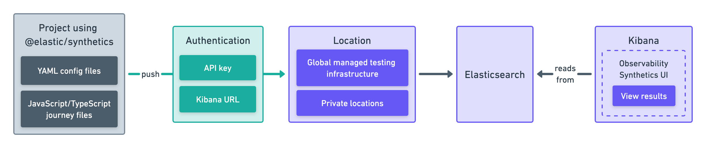
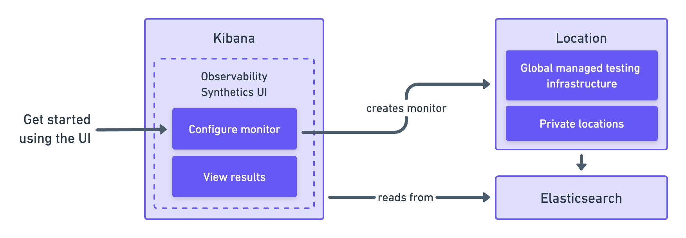

To set up a synthetic monitor, you need to configure the monitor, run it, and send data back to ((es)).
After setup is complete, the data will be available in ((kib)) to view, analyze, and alert on.

There are two ways to set up a synthetic monitor:

* ((project-monitors-cap))
* The ((synthetics-app))

Read more about each option below, and choose the approach that works best for you.

## ((project-monitors-cap))

With Elastic ((project-monitors-cap)), you write tests in an external version-controlled
project using YAML for lightweight monitors and JavaScript or TypeScript for browser monitors.
Then, you use the `@elastic/synthetics` NPM library's `push` command to create
monitors in ((kib)).

This approach works well if you want to create both browser monitors and lightweight
monitors. It also allows you to configure and update monitors using a GitOps workflow.

Get started in <DocLink slug="/en/observability/synthetics-get-started-project">Create monitors with ((project-monitors-cap))</DocLink>.

{/* add text description */}

## ((synthetics-app))

The ((synthetics-app)) is an application in ((kib)).
You can create monitors directly in the ((synthetics-app)) using the user interface.

This approach works well if you want to configure and update monitors using a
UI in your browser.

Get started in <DocLink slug="/en/observability/synthetics-get-started-ui">Create monitors in the ((synthetics-app))</DocLink>.

{/* add text description */}

<DocCallOut title="Note">

The Elastic Synthetics integration is a method for creating
synthetic monitors that is no longer recommended.
**Do not use the Elastic Synthetics integration to set up new monitors.**

For details on how to migrate from Elastic Synthetics integration to
((project-monitors)) or the ((synthetics-app)), refer to <DocLink slug="/en/observability/synthetics-migrate-from-integration">Migrate from the Elastic Synthetics integration</DocLink>.

If you've used the Elastic Synthetics integration to create monitors in the past
and need to reference documentation about the integration, go to the
[8.3 documentation](https://www.elastic.co/guide/en/observability/8.3/uptime-set-up.html#uptime-set-up-choose-agent).

</DocCallOut>
