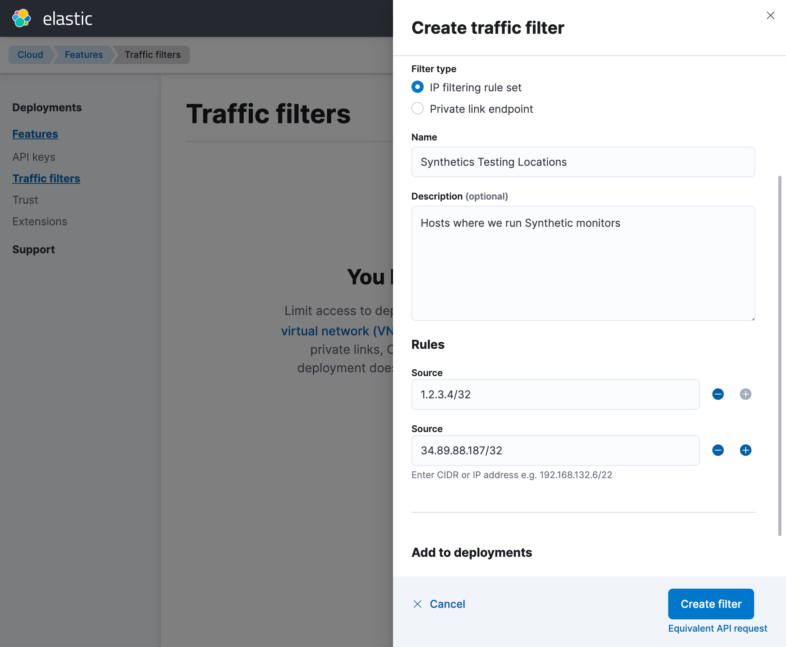

<div id="synthetics-traffic-filters"></div>

If you are setting up Synthetics for a deployment configured with
[traffic filters](((cloud))/ec-traffic-filtering-deployment-configuration.html),
none of your results will be visible in the ((synthetics-app)) until permission
to write the results to ((es)) is explicitly granted.

If you don't configure the traffic filters, the tests will run,
but in the UI it will appear like they are not running because the results
cannot be written back to ((es)).

<div id="obtain_the_ip_address"></div>

## Obtain the IP address

The IP address or CIDR block of the hosts running the tests
need to be configured in your [Traffic filters](((cloud))/ec-traffic-filtering-ip.html)
to allow inbound connection into your ((es)) instance to store the results.

The IP addresses to be used depend on where the monitors are running, either
on Elastic's global managed testing infrastructure or ((private-location))s.

<div id="elastic's_global_managed_testing_infrastructure"></div>

### Elastic's global managed testing infrastructure

If you're running tests on Elastic's global managed testing infrastructure,
you can find the relevant IP CIDR block (a single address or /32 block for each region)
in  [this list of egress IPs](https://manifest.synthetics.elastic-cloud.com/v1/ip-ranges.json).
This list is a JSON object that contains each region in Elastic's global managed testing
infrastructure and the address that outbound connections will be made from.
These will be the connections into your ((es)) cluster.

For example, the `Europe - United Kingdom` region has the following entry:

```json
"europe-west2-a": {
   "ip_prefix": ["34.89.88.187/32"],
   "name": "Europe - United Kingdom"
}
```

To run tests from the `Europe - United Kingdom` region, you need to enable access
from the `34.89.88.187/32` CIDR block.

<DocCallOut title="Note">

Note that as regions are added, this list will change.
Similarly existing region addresses are subject to change.

</DocCallOut>

<div id="((private-location))s"></div>

### ((private-location))s

If you're running tests from <DocLink id="enObservabilitySyntheticsPrivateLocation">((private-location))s</DocLink>,
you will have the ((agent)) installed on host machines that run the tests.
You need to obtain the address ranges for these machines.
This needs to be the IP address that the host is making the connection from
into the ((es)) cluster. This _might not_ be the IP address bound to the
network interface of the host machine, but the proxy or other address based on
your network configuration.

<div id="add_the_traffic_filter"></div>

## Add the traffic filter

Once you know the CIDR blocks for your testing sources, add them to your ((es)) deployment.
Find detailed instructions in the [IP traffic filters](((cloud))/ec-traffic-filtering-ip.html) docs.

For example, if you had a ((private-location)) running with a public CIDR block of `1.2.3.4/32`
and were running tests from the `Europe - United Kingdom` region,
you would first create a traffic filter with the following:



Once the traffic filter has been created, it needs to be assigned to the deployment from which
you're managing monitors from (the deployment containing the ((es)) cluster where your results need to go).
